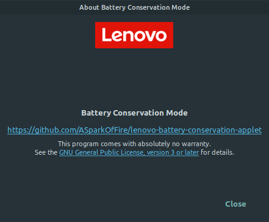

<h1 align="center">
  
  <br />
  Lenovo Battery Conservation Applet
</h1>
<p align="center"><b>Applet to Toggle Battery Conservation Feature present in some Lenovo Laptops.</b></p>

<div align="left"></div><div align="right"></div>

## Installation

```bash
curl -fsSL https://raw.githubusercontent.com/ASparkOfFire/lenovo-battery-conservation-applet/master/install.sh | bash
```


## Thanks to
* https://github.com/linuxmint/nvidia-prime-applet
